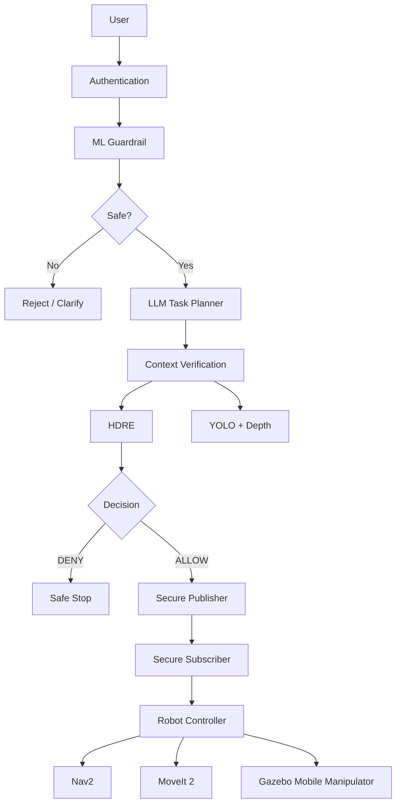
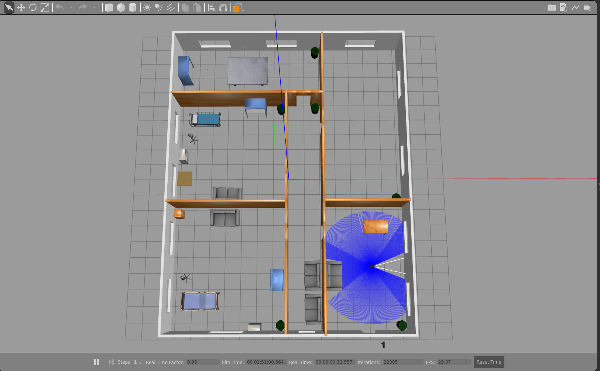
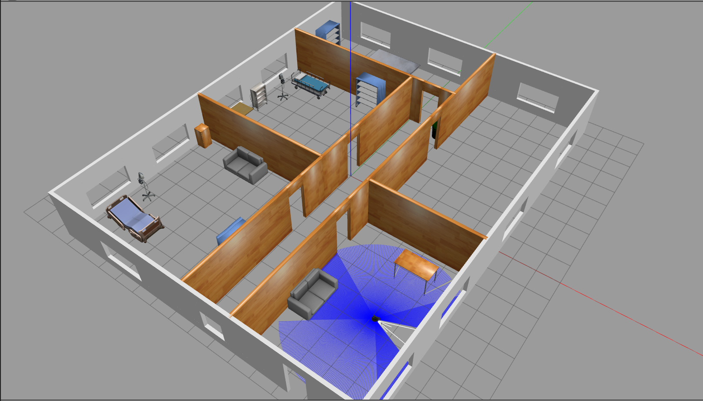
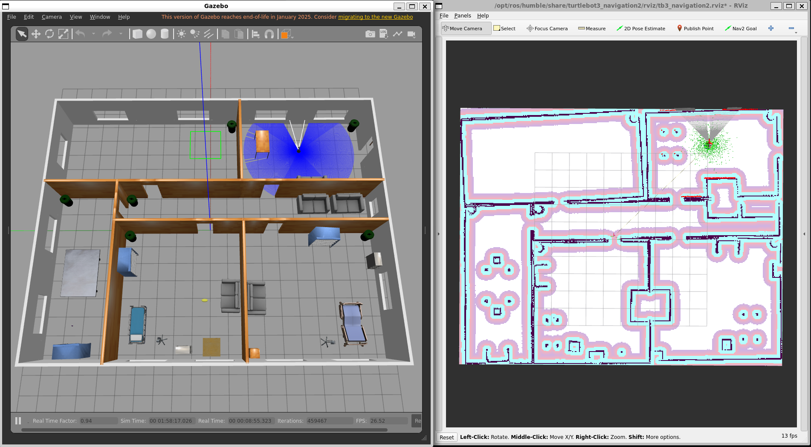
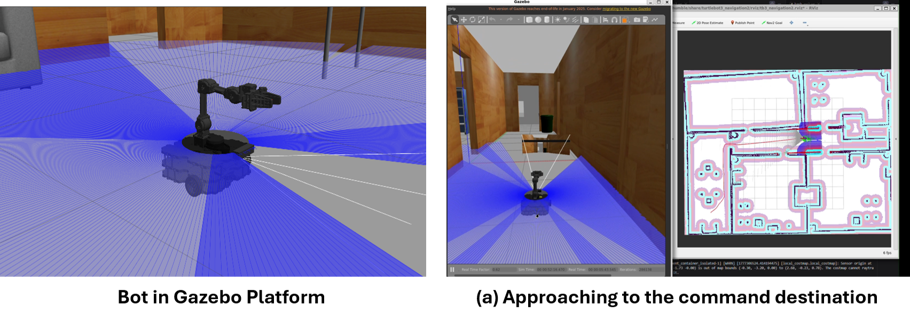
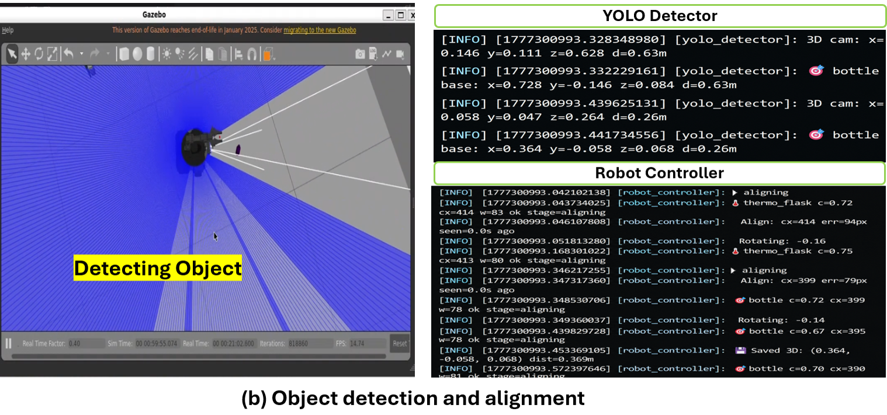
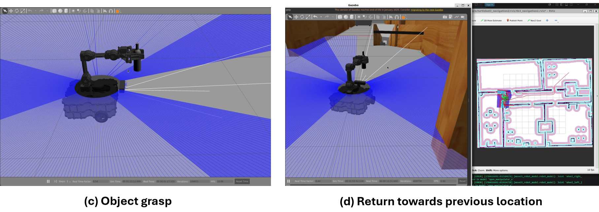
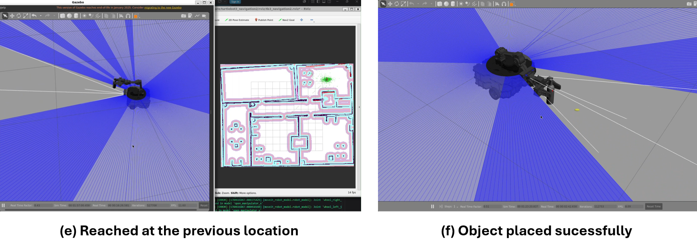
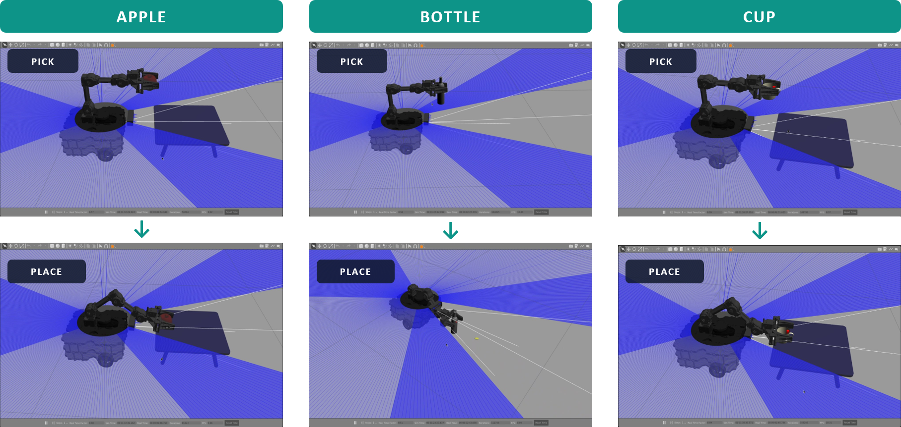
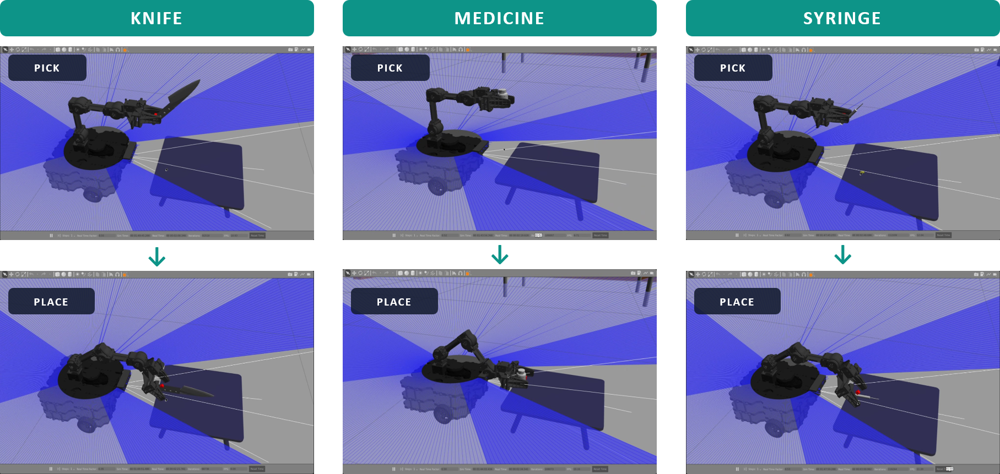

# Trustworthy LLM-Based Service Robot

A ROS 2-based research framework for **trustworthy natural-language task planning and secure execution in a mobile-manipulator service robot**. The system combines an LLM task planner with local ML safety guardrails, perception-based context verification, hierarchical risk assessment, cryptographic command protection, and ROS 2 robot execution.

> **Research project:** *A Trustworthy LLM-Based Service Robot Framework with Hierarchical Decision and Secure ROS2 Execution*

## Overview

Large Language Models (LLMs) can make robots easier to command through natural language, but directly converting an LLM-generated plan into robot actions introduces safety, security, and execution risks.

This project addresses that problem with a **defense-in-depth architecture** in which a natural-language request is progressively authenticated, safety-checked, interpreted, context-verified, risk-assessed, cryptographically protected, and only then executed by the robot.

### Core pipeline

```text
User Command
     │
     ▼
Authentication
     │
     ▼
ML Safety Guardrail
     │
     ├── Unsafe / ambiguous ──► Reject / Clarify
     │
     ▼
LLM Task Planner
     │
     ▼
Context Verification
(YOLO + Depth)
     │
     ▼
Hierarchical Dynamic Risk Engine (HDRE)
     │
     ├── DENY ────────────────► Safe Stop / Reject
     │
     ▼
Secure ROS 2 Publisher
(AES-256-GCM + HKDF + Ed25519)
     │
     ▼
Secure ROS 2 Subscriber
(Freshness + Replay + Signature + Decryption)
     │
     ▼
Robot Controller
     │
     ├── Navigation
     ├── Detection
     ├── Pick
     ├── Navigation to destination
     └── Place
```

## Key Contributions

- **LLM-based natural-language task planning** for service-robot tasks.
- **Local ML guardrail** for safety-oriented command classification.
- **Clarification handling** for ambiguous requests.
- **YOLO-based visual perception** with depth verification for contextual validation.
- **Hierarchical Dynamic Risk Engine (HDRE)** for multi-factor safety decisions.
- **Secure ROS 2 command transport** using authenticated encryption and digital signatures.
- **Freshness and replay protection** for robot commands.
- **Fail-safe execution behavior**, including an emergency-stop path for invalid secure messages.
- **ROS 2 + Gazebo simulation** of a mobile manipulator.
- **MoveIt 2-based manipulation** with custom simulation objects and pick-and-place experiments.

## System Architecture



## Safety and Trust Architecture

The framework separates **language understanding**, **safety validation**, **environmental verification**, **risk assessment**, and **robot execution** rather than allowing the LLM to directly control the robot.

### ML Guardrail

The local guardrail model classifies user requests into safety-oriented categories:

| Label | Meaning |
|---|---|
| `SAFE` | Request can proceed to subsequent validation |
| `UNSAFE_WEAPON` | Weapon-related unsafe request |
| `UNSAFE_EXPLOSIVE` | Explosive-related unsafe request |
| `UNSAFE_PHYSICAL_HARM` | Physical-harm-related unsafe request |
| `AMBIGUOUS` | Request requires clarification |
| `UNSAFE_DRUGS` | Drug-related unsafe request |
| `UNSAFE_PRIVACY` | Privacy-related unsafe request |

The repository contains the ROS 2 integration for the local guardrail model; trained model artifacts are intentionally not committed to Git.

### Context Verification

The robot does not rely solely on the language request. Visual context is checked using:

- YOLO object detection
- RGB/depth information
- Detection confidence
- Robot/environment state

This provides an additional verification layer before execution.

## Hierarchical Dynamic Risk Engine (HDRE)

The HDRE combines multiple risk dimensions instead of making the final decision from a single model output.

The framework uses the following risk factors:

- `I` — Intent Risk
- `C` — Context Risk
- `O` — Object Risk
- `H` — Human Risk
- `P` — Policy Risk
- `A` — Authentication Risk
- `R` — Robot State Risk

### Stage 1 — Identity Trust

\[
T = 1 - (\alpha A + \beta P)
\]

where `T` represents the trust score derived from authentication and policy-related risk.

### Stage 2 — Environmental Safety

\[
S = 1 - (\gamma C + \delta O + \epsilon H + \zeta R)
\]

where `S` represents environmental and robot-state safety.

### Stage 3 — Mission Risk

\[
M = \lambda I + \mu(1-T) + \nu(1-S)
\]

The resulting risk assessment is evaluated against configured safety/trust thresholds before a task is allowed to proceed.

## Secure ROS 2 Execution

The secure communication layer protects commands between the planning/safety pipeline and robot execution.

Implemented mechanisms include:

| Mechanism | Purpose |
|---|---|
| AES-256-GCM | Confidentiality and authenticated encryption |
| HKDF | Per-message key derivation |
| Ed25519 | Digital signatures and authenticity |
| Timestamp freshness | Reject stale commands |
| Replay cache | Reject previously processed messages |
| AAD/context binding | Bind protected data to message context |
| Emergency-stop path | Fail safely on validation/cryptographic failure |

The implementation uses environment/configuration-based key handling. Secret keys and credentials are **not stored in the repository**.

## Perception

The perception subsystem uses YOLO for object detection and depth information for contextual verification.

### YOLO evaluation results

The reported evaluation results for the two-class detector are:

| Metric | Overall |
|---|---:|
| Precision | 0.851 |
| Recall | 0.895 |
| mAP@0.5 | 0.897 |
| mAP@0.5:0.95 | 0.699 |

Class-wise results:

| Class | Precision | Recall | mAP@0.5 | mAP@0.5:0.95 |
|---|---:|---:|---:|---:|
| Bottle | 0.886 | 0.949 | 0.951 | 0.787 |
| Thermo flask | 0.817 | 0.841 | 0.843 | 0.610 |

Model weights are excluded from Git and should be supplied separately.

## Robot Simulation

The project uses a ROS 2 simulation environment with:

- TurtleBot3-based mobile platform
- Robotic arm and gripper
- Gazebo simulation
- RViz2
- Nav2 for navigation
- MoveIt 2 for manipulation
- Custom Gazebo/SDF objects
- Camera and depth sensing

The repository includes simulation assets for objects used during manipulation experiments, including bottles, thermo flasks, cups, apples, medicine boxes, syringes, and a mini table.

## Pick-and-Place

The manipulation workflow follows a staged state-machine style execution:

```text
Navigate
   ↓
Detect
   ↓
Pick
   ↓
Navigate to destination
   ↓
Place
   ↓
Task Completed
```

If the requested object cannot be found, the controller can transition to a safe idle/not-found behavior rather than blindly executing the manipulation sequence.

## Demonstration

The following screenshots show the implemented ROS 2/Gazebo service-robot system, including the simulation environment, authorized robot execution, navigation, and pick-and-place manipulation.

### Simulation Environment

<p align="center">
  
</p>

<p align="center">
  
</p>

<p align="center">
  
</p>

*Gazebo simulation environments used for the mobile-manipulator experiments.*

### Authorized Robot Execution

<p align="center">
  
</p>

<p align="center">
  
</p>

<p align="center">
  
</p>

<p align="center">
  
</p>

*Authorized robot execution demonstrating navigation, object approach, perception, and task execution in the simulated environment.*

### Pick-and-Place Manipulation

<p align="center">
  
</p>

<p align="center">
  
</p>

*Pick-and-place manipulation performed using the simulated mobile manipulator.*

### Full System Demonstration

A complete implementation video is available separately and demonstrates robot navigation, obstacle/collision handling, object detection, and pick-and-place task execution.

> **Demo video:** [Watch the full system demonstration](https://lnkd.in/p/eNTiZKgY)

## ROS 2 Packages

The repository contains the following main ROS 2 packages:

```text
ros2_ws/src/
├── guardrail_pkg/
│   ├── add_collision_object.py
│   ├── arm_ik.py
│   ├── clarification_node.py
│   ├── context_verification_node.py
│   ├── depth_processor.py
│   ├── guardrail_node.py
│   ├── hdre_node.py
│   ├── local_ml_guardrail.py
│   ├── moveit_pick_place.py
│   ├── otp_auth_node.py
│   ├── robot_cli.py
│   ├── robot_controller.py
│   ├── secure_pub.py
│   ├── secure_sub.py
│   └── yolo_detector.py
│
├── llm_task_planner/
│   └── llm_task_planner.py
│
├── intent_safety/
│   ├── intent_node.py
│   ├── train_model.py
│   └── model/vectorizer artifacts
│
├── mobile_manipulator_description/
│   └── robot description / ros2_control
│
└── my_worlds/
    ├── launch/
    ├── world/
    └── robot/simulation assets

simulation/
├── external/
│   └── IFRA_LinkAttacher/   # Git submodule
└── robot/
    └── my_robot/
```

## Main Components

### `guardrail_pkg`

Contains the safety, security, perception, risk-assessment, manipulation, and robot-control components.

Important nodes/components include:

- `guardrail_node`
- `local_ml_guardrail`
- `clarification_node`
- `context_verification_node`
- `yolo_detector`
- `hdre_node`
- `otp_auth_node`
- `secure_pub`
- `secure_sub`
- `robot_controller`
- `robot_cli`
- `moveit_pick_place`

### `llm_task_planner`

Provides LLM-based natural-language task planning and converts user requests into structured robot task plans.

### `intent_safety`

Provides intent classification and safety-oriented intent assessment.

### `mobile_manipulator_description`

Contains the robot description and `ros2_control` configuration.

### `my_worlds`

Contains Gazebo worlds, robot simulation assets, camera configuration, and launch resources.

## Repository Structure

```text
trustworthy-llm-service-robot/
├── README.md
├── .gitignore
├── .gitmodules
│
├── ros2_ws/
│   └── src/
│       ├── guardrail_pkg/
│       ├── llm_task_planner/
│       ├── intent_safety/
│       ├── mobile_manipulator_description/
│       └── my_worlds/
│
└── simulation/
    ├── external/
    │   └── IFRA_LinkAttacher/
    └── robot/
        └── my_robot/
```

## Requirements

The implementation was developed around:

- Ubuntu under WSL2
- ROS 2 Humble
- Gazebo
- Python 3
- ROS 2 `colcon`
- Nav2
- MoveIt 2
- PyTorch / Transformers
- Ultralytics YOLO
- OpenCV
- NumPy
- Cryptographic libraries used by the secure communication nodes

The project was developed and tested in a Windows 11 + WSL2 environment.

## Installation

### 1. Clone the repository

```bash
git clone https://github.com/msrafi10/trustworthy-llm-service-robot.git
cd trustworthy-llm-service-robot
```

### 2. Initialize the Git submodule

```bash
git submodule update --init --recursive
```

### 3. Source ROS 2

For ROS 2 Humble:

```bash
source /opt/ros/humble/setup.bash
```

### 4. Build the workspace

```bash
cd ros2_ws
colcon build --symlink-install
```

Then:

```bash
source install/setup.bash
```

### 5. Verify the packages

```bash
ros2 pkg list | grep -E "guardrail_pkg|llm_task_planner|intent_safety|mobile_manipulator_description|my_worlds"
```

The repository should build as a five-package ROS 2 workspace.

## Configuration

Sensitive values and machine-specific model paths should be configured through environment variables rather than committed to Git.

Examples used by the project include:

```bash
export AUTH_USER="your_username"
export AUTH_PASS="your_password"
export GUARD_KEY="your_secure_key"
export YOLO_MODEL_PATH="$HOME/yolo_model/service_robot_7class/weights/best.pt"
```

Do **not** commit real passwords, cryptographic keys, model credentials, API keys, or private certificates.

For local development, configure these variables in your own shell/environment rather than placing secrets in the repository.

## Running the System

The exact launch sequence depends on the simulation/world configuration you want to evaluate. The main workflow is:

1. Start the ROS 2/Gazebo simulation.
2. Start the required robot controllers.
3. Start perception and depth-processing nodes.
4. Start the authentication and guardrail components.
5. Start the LLM task planner.
6. Start HDRE and secure communication components.
7. Start the robot controller.
8. Submit a task through the robot CLI or the configured ROS 2 input interface.
9. Observe the safety decision and robot execution in Gazebo/RViz2.

Available executable names can be inspected with:

```bash
ros2 pkg executables guardrail_pkg
```

and:

```bash
ros2 pkg executables llm_task_planner
ros2 pkg executables intent_safety
```

Because model files, credentials, and machine-specific paths are intentionally excluded from Git, those resources must be configured locally before running the corresponding nodes.

## Security Design Principles

The system follows several defense-in-depth principles:

1. **Authenticate the user before accepting protected tasks.**
2. **Do not allow the LLM to directly command actuators.**
3. **Use a local safety guardrail before planning/execution.**
4. **Verify physical context using perception and depth.**
5. **Apply hierarchical risk assessment before execution.**
6. **Cryptographically protect commands in transit.**
7. **Reject stale or replayed messages.**
8. **Fail safely when security validation fails.**
9. **Keep credentials, keys, and model weights outside version control.**

## Experimental Evaluation

The end-to-end validation recorded the following execution counts:

| Event | Count |
|---|---:|
| Task completed | 13 |
| `task_plan` published | 15 |
| HDRE `ALLOW` decisions | 13 |
| Encrypted messages published | 15 |
| Messages decrypted | 15 |

Representative measured component latencies included:

| Component | Observed range |
|---|---:|
| LLM planning | ~6.45–49.51 s in recorded runs |
| Context verification | ~0.284–7.866 ms |
| HDRE | ~0.351–5.639 ms |
| Secure publish encryption/signing | ~0.676–35.450 ms |

LLM planning latency was substantially larger than the local verification/security stages in the recorded experiments. GPU resource contention between YOLO perception and the LLM planner was also observed during development.

These values are **recorded experimental observations**, not universal performance guarantees.

## Research Focus

The project investigates how an LLM-based service robot can combine:

- Natural-language interaction
- Machine-learning safety classification
- Visual context verification
- Hierarchical risk assessment
- Secure ROS 2 communication
- Autonomous navigation
- Robotic manipulation
- Fail-safe execution

The central design principle is:

> **An LLM may propose a task, but multiple independent safety and security layers determine whether that task is permitted to reach the robot.**

## Limitations

Current limitations include:

- The repository is primarily a simulation/research implementation rather than a complete production deployment.
- LLM planning latency can be significant.
- Running perception and LLM inference simultaneously can create GPU resource contention.
- Model weights and some external dependencies are not included in the repository.
- Real-world deployment requires additional hardware-level safety validation, including physical emergency-stop mechanisms and platform-specific safety certification.

## Future Work

Potential extensions include:

- More extensive real-world validation.
- Improved resource scheduling between perception and LLM inference.
- More robust multimodal grounding.
- Expanded manipulation and navigation tasks.
- Hardware deployment with independent low-level safety controls.
- Broader adversarial and fault-injection testing.
- Larger-scale evaluation across diverse service-robot scenarios.

## Author

**Mostofa Shakil Rafi**  
Mechatronics Engineering, Rajshahi University of Engineering & Technology (RUET)

GitHub: **[msrafi10](https://github.com/msrafi10)**

## Citation

If you use this repository or its implementation in academic work, please cite the associated research work when its final bibliographic information is available.

```text
Mostofa Shakil Rafi.
A Trustworthy LLM-Based Service Robot Framework with
Hierarchical Decision and Secure ROS2 Execution.
```

## License

This project is released under the **MIT License**. See the `LICENSE` file for details.
